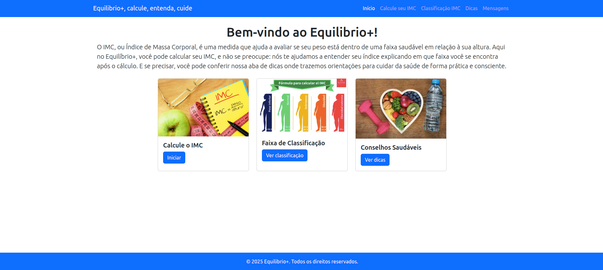
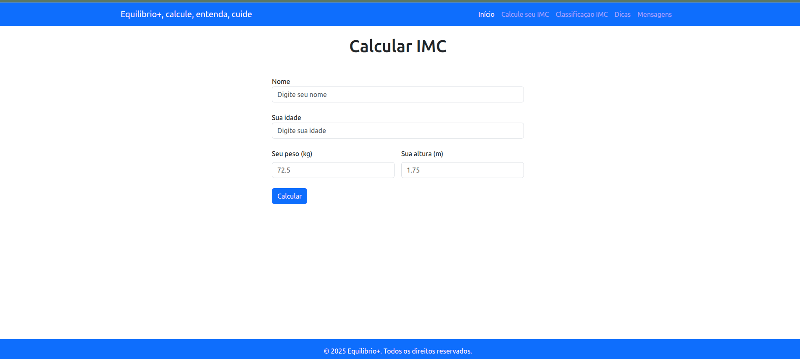
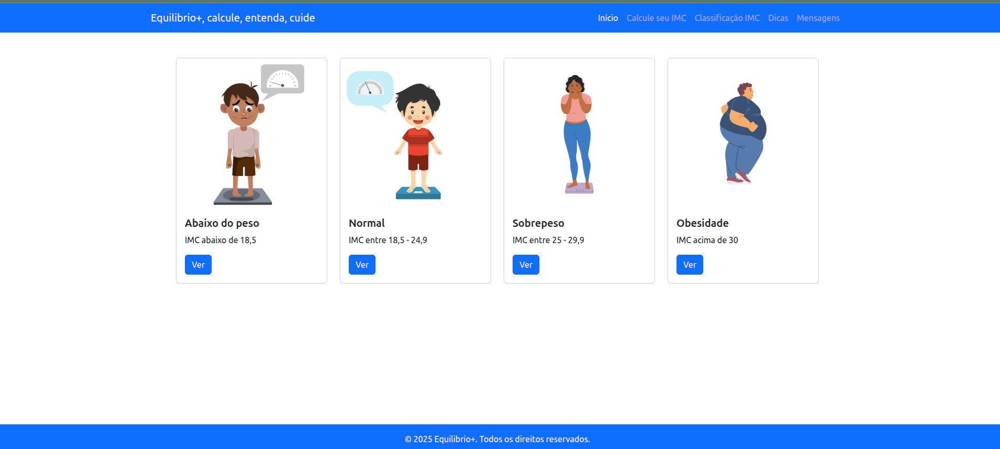
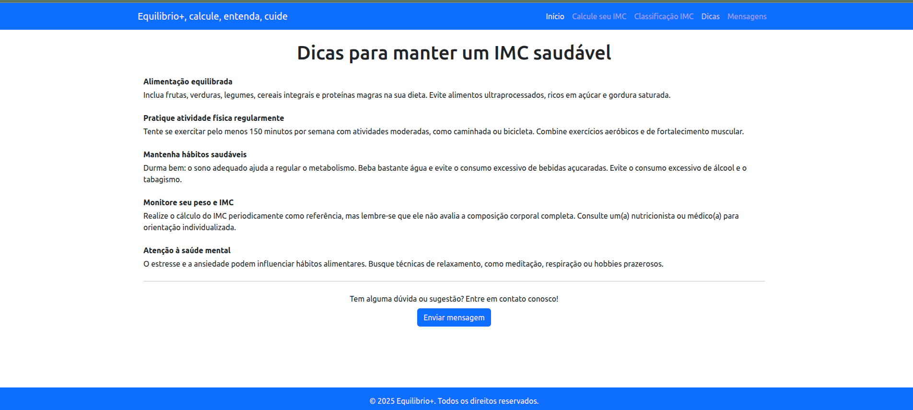
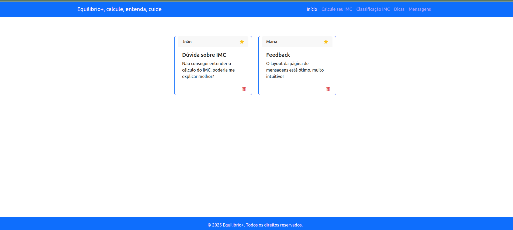

# Equilibrio+ | Calcule, Entenda, Cuide

**Equilibrio+** é uma aplicação web que auxilia no cálculo do IMC, oferece informações sobre a faixa de classificação do IMC, dicas de saúde e permite enviar e visualizar mensagens de dúvidas e sugestões.

  
---

## Funcionalidades

1. **Calculadora de IMC**  
   - Permite calcular o IMC a partir do peso e altura do usuário.
   - Exibe o resultado em um modal com informações detalhadas (nome, idade, peso, altura e IMC).
   {width=400} 


2. **Classificação do IMC**  
   - Tela que mostra faixas de classificação do IMC com cards informativos.
   - Cada card contém título, imagem, classificação e descrição detalhada.
   {width=400}  

3. **Dicas e Sugestões**  
   - Formulário para enviar dúvidas ou sugestões.
   - As mensagens enviadas são armazenadas em uma API externa (CRUD CRUD).
   {width=400} 

4. **Mensagens Recebidas**  
   - Tela que exibe as mensagens enviadas em cards.
   - Permite favoritar mensagens clicando na estrela e excluir mensagens.
   - As alterações são persistidas na API (favorito e exclusão).
   {width=400}  

---

## Tecnologias Utilizadas

- **HTML** – Estrutura das páginas.
- **Bootstrap** – Estilização e modais.
- **JavaScript** – Lógica de cálculo, manipulação do DOM e requisições à API.
- **API CRUD CRUD** – Armazenamento e gerenciamento das mensagens do usuário.

---

## Objetivos do Projeto

- Aplicar **cálculos matemáticos** em JavaScript (IMC).  
- Criar e manipular **funções** para modularizar o código.  
- Trabalhar com **arrays** para listar, editar e deletar informações.  
- Manipular **formulários** e capturar dados do usuário.  
- Integrar **front-end** com uma **API externa** para persistência de dados.  

---

## Como Executar

1. Clone o repositório:

   ```bash
   git clone https://github.com/Ignacio-fabianamaria/IMC-HTML-JAVASCRIT.git
   ```

2. Configurar API para utilizar a funcionalidade de mensagens:

A aplicação utiliza a API CRUD CRUD para armazenar mensagens.
Acesse o site, gere uma nova URL de API e copie esse nova url.
Abra o arquivo script.js e atualize a variável apiUrl no início do arquivo com a sua URL.

```bash
const apiUrl = "https://sua-nova-url.crudcrud.com";
```

## Como o Código Funciona

O projeto **Equilibrio+** possui várias funções que organizam o comportamento das telas e interações. Aqui está uma explicação detalhada de cada uma:

### 1. `getTemplate(pagina)`

- Função responsável por carregar dinamicamente o conteúdo das telas (HTML) no elemento principal.
- Parâmetro `pagina` define qual template carregar: **calcular**, **classificacao**, **dicas**, **mensagens**.
- Após carregar o HTML, ela inicializa a função correspondente à página, por exemplo, `getIMC()` ou `getMensagens()`.

### 2. `getData()`

- Busca os dados do arquivo `data.json` e armazena no array `data`.
- Utilizada na tela de **Classificação** para renderizar os cards de IMC.
- Chama a função `generateCards()` para criar os cards dinamicamente.

### 3. `getIMC()`

- Captura os valores do formulário de IMC: nome, idade, peso e altura.
- Calcula o IMC usando a fórmula:  
  `IMC = peso / (altura em metros)²`
- Exibe o resultado dentro de um modal com Bootstrap.

### 4. `generateCards()`

- Cria os cards de classificação do IMC dentro do container da página.
- Cada card possui título, imagem, classificação e um botão “Ver”.
- Ao clicar em “Ver”, abre um modal mostrando os detalhes da classificação.

### 5. `postMensagem()`

- Captura os valores do formulário de mensagens na tela **Dicas** (nome, assunto, mensagem).
- Cria um objeto `novaMensagem` com `favorito: false` por padrão.
- Envia a mensagem para a API do [CrudCrud](https://crudcrud.com/) usando `fetch` com método `POST`.

### 6. `getMensagens()`

- Busca todas as mensagens armazenadas na API.
- Atualiza o array `data` com as mensagens e chama `generateMensagensCards()` para renderizar os cards.

### 7. `generateMensagensCards()`

- Cria os cards de mensagens dentro do container correspondente.
- Cada card possui:
  - Nome do remetente
  - Assunto
  - Mensagem
  - Ícone de estrela (favorito)
  - Ícone de lixeira (deletar)
- Adiciona **event listener** ao container para:
  1. **Deletar mensagem**: Remove do DOM, do array `data` e da API.
  2. **Favoritar mensagem**: Alterna a estrela entre vazia e preenchida, atualiza `favorito` no array `data` e envia `PUT` para a API.
